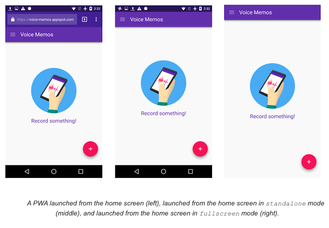
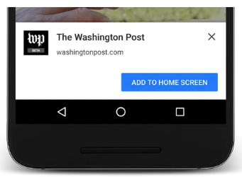
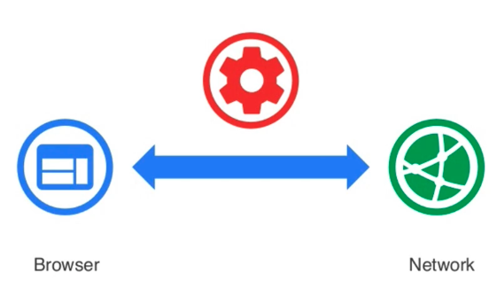
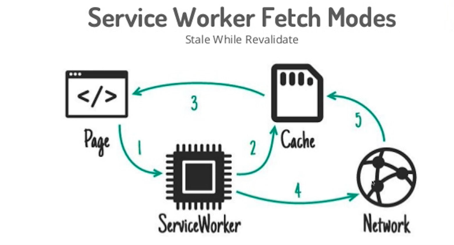
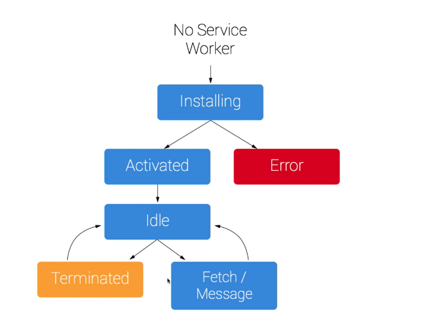

# PWA Tutorial

## 1) 🔥 PWA소개

- 모바일 앱과 같은 경험을 주는 최신 웹 앱
- 앱 아이콘, 앱 아이콘 설치배너, 모바일 푸시, 오프라인 경험을 제공
- HTML, CSS, JS로 구현하는 웹 애플리케이션

> "높은 사용자 경험을 제공하기 위한 웹 앱의 진화"

### 등장배경

- 모바일 시장의 폭잘적인 성장
- 모바일 웹 보다는 모바일 애플리케이션을 많이 사용한다. ex) 아이콘
- 모바일 앱 영역을 커버하기 위한 시도들 - Hybrid App, React Native
  - 안드로이, IOS에 최종적으로 종속적이다.
- 순전하게 웹 기술만으로 만들어 내고 싶다.
- Offline Web의 필요성

### 특징

- Responsive
  - 반응형 웹 디자인
- 🟣 App-like & Discoverable
  - 설치 배너가 생성된다.
  - 앱 아이콘이 생성된다.
- 🔴 Engageable
  - push 알람.
  - PC와 단말기 커버가 가능하다.
- Connectivity
  - Online = Offline 경험을 제공한다.
- Safe
  - 제약사항 기본 기술
  - https 프로토콜이 있어야 가능하다.

### 적용사례

- instagram, uber, twitter...

### 제작기술

- manifest.json
- Service Workers: client-side Javascript Proxy
  

### 지원 브라우저


## 2) 🌐 웹 앱 매니페스트 구성하기.

- Web App Manifest - install Banner & App Icon

### 2-1) Web App Manifest 란?

- Progressive Web App의 설치와 앱 구성정보를 담고 있는 Json형식의 설정파일
  - 앱 아이콘, 화면 런쳐방식 및 배경색, 시작페이지 등을 설정할 수 있는 JSON파일
- 앱 관련 구성정보에는 아래와 같은 항목들이 설정 됩니다.
  - Start URL: 웹 앱이 시작되는 시점
  - Launch Image: 웹 앱 시작 화면
  - Display Type: 웹 앱의 화면 형태
  - Display Orientation: 웹 앱 화면 방향
  - App Icon: 앱 아이콘 이미지와 크기
  ```json
  {
    "short_name": "앱 아이콘 이름",
    "name": "하단 설치 배너에 표기될 이름 & 앱에서 검색시 키워드",
    "icons": [
      {
        "src": "dist/images/icons.icon-32x32.png",
        "type": "images/png",
        "size": "32x32"
      },
      {}
    ],
    "background_color": "#1E88E5",
    "display": "standalone",
    "start_url": "./"
  }
  ```

### 2-2) Web App Manifest 파일 등록

- 메인 HTML 파일의 head에 meta 태그 추가

```html
<link rel="manifest" href="/mainfest.json" />
```


> Chrome > 검색(개발자도구) > Application 에서 Manifest내용을 확인 할 수 있습니다.

### 2-3) Web App Manifest 주요 구성 정보

#### 1️⃣. App Icon

- 해당 웹 사이트가 모바일 화면에서 표시될 아이콘 이미지 지정

  - src: 로딩할 이미지 파일경로
  - type: 로딩할 이미지 타입
  - size: 로딩할 이미지 크기

```json
{
  "icons": [
    {
      "src": "images/touch/icon-128x128.png",
      "type": "image/png",
      "size": "128x128"
    },
    {
      "src": "images/touch/icon-152x152.png",
      "type": "image/png",
      "size": "152x152"
    },
    {
      "src": "images/touch/icon-192x192.png",
      "type": "image/png",
      "size": "192x192"
    }
  ]
}
```

#### ❗️❗️❗️ 주의 사항 ❗️❗️❗️

- app icon 미지정시 html파일의 link rel="icon"> 태그를 검색한다.
- Safari의 경우 아래의 meta 태그를 head에 별로돌 추가해 주어야 한다.

```html
<link rel="apple-touch-icon" href="touch-icon-iphone.png" />
<link rel="apple-touch-icon" sizes="152x152" href="touch-icon-ipad.png" />
<link
  rel="apple-touch-icon"
  sizes="180x180"
  href="touch-icon-iphone-retina.png"
/>
<link
  rel="apple-touch-icon"
  sizes="167x167"
  href="touch-icon-ipad-retina.png"
/>
```

#### 2️⃣. Launch Image - Splash Screen

- 웹앱이 시작될 때 거치는 시작 화면을 설정 가능
- 모바일 앱의 시작과 동일한 느낌을 가져감
- 화면의 조합: 아이콘 + 배경색 + 아이콘 이름
  - 배경색 설정의 <b>background_color</b>속성 이용
  ```json
  { "background_color": "#FFF" }
  ```
  - 아이콘은 icon에 지정한 이미지 중 128dp = 192px에 가장 가까운 크기로 지정
  - 따라서, 192px 크기의 이미지는 꼭 지정
    > dp: 다양한 모바일 화면 크기에 동일한 비율로 출력되게 하는 픽셀단위

#### 3️⃣. Start URL

- 앱이 시작될 때 로딩될 페이지 위치 지정

```json
{ "start_url": "./" }
```

- GA 분석이나 기타 목적으로 query string을 뒤에 붙일 수 있다.

```json
{ "start_url": "index.html?q=hello" }
```

#### 4️⃣. Display Type

- 웹앱 화면의 전체적인 모양을 정할 수 있다.
- 웹앱이 모바일 앱의 느낌을 가져갈 수 있도록 결정짓는 속성
  - standalone: 상단 URL바 제거 하여 네이티브 앱 느낌제공
  - browser: 해당 OS브라우저에서 웹앱 실행
  - fullscreen: 크롬이 아닌 기타 브라우저에서 네이티브 앱 느낌 제공
  - minimul-ui: fullscreen과 비슷하나 네이게이션 관련 최소 UI를 제공

```json
{ "display": "standalone" }
```



#### ❗️❗️❗️ 주의 사항 ❗️❗️❗️

- IOS에서 standalone 사용시
  - a tag를 이용한 네비케이션 이동 시 새 브라우저 열기로 인해 context를 잃게 됨.
  - location.href 또는 SPA를 이용한 네비게이팅으로 전체 UX를 가져갈 필요가 있음

```html
<meta name="apple-mobile-web-app-capable" content="yes" />
```

#### 5️⃣. Theme Color

- theme-color를 이용하여 앱 테마 색상을 정의할 수 있다.
- 홈 화면에서 시작해야 설정한 도메인의 모든 페이지에 적용됨.

```json
{ "theme-color": "#0093FB" }
```

#### 6️⃣. Display Orientation

- 화면 방향은 orientation 속성을 이용하고 옵션 값은 아래와 같다.
  - portrait: 세로방향
  - landscap: 가로방향

```json
{ "orientation": "landscap" }
```

#### 7️⃣. Web App Install Banner 🔆

- PWA가 모바일 적인 특징을 가지는 큰 부분중 하나
- 기본 모바일 앱 개발 주기: 구현 > SDK 빌드 > 스토어 배포 > 검색 > 앱 다운 > 설치 > 사용
- PWA의 앱 개발 주기: 구현 > 사이트 배포 > 검색 > 사용(자동설치⁉️)
  

- Install Banner 동작 조건

  - 웹 사이트가 설치되어 있지 않음
    - home화면
  - 사용자가 최소 30초 이상 웹 사이트를 탐색
  - start_url, short_name, name 설정
  - 최소 192px 크키의 앱 아이콘 이미지
  - Service Worker의 fetch 이벤트 구현
  - HTTPS

- beforeinstallprompt로 설치 배너의 표시 시기를 지연하거나 disable가능

```javascript
let defferedPrompt;
//설치 가능한지 확인
window.addEventListener("beforeinstallprompt", (e) => {
  e.preventDefault();
  defferedPrompt = e;
});

//특정 버튼 클릭 시에 앱 설치
btn.addEventListener("click", (e) => {
  defferedPrompt.prompt();
  defferedPrompt.userChoice.then((res) => {
    if (res === "accepted") {
      console.log("The app has been installed");
    }
    defferedPromts = null;
  });
});
```

- install Banner 디버깅.
  - 주소창 chrome://flags
  - 설정 옵션 중 사용자 참여검사 우회 체크하여 조건 충족

## 3) 🌟 Service Worker - Cahching, Offline, Native Features

### 3-1) 소개

- 브라우저와 서버 사이의 미들웨어 역할을 하는 스크립트 파일
- PWA에서 가장 중요한 역할을 하고, Offline Expreience와 Mobile & Web Push의 기반기술]



> 브라우저와 서버 사이에 미들웨어 역할을 하는 스크립트 입니다.
> ❗️다른 영역에 있는 자바스크립트 파일!!

### 3-2) 특징

- 브라우저 뒤에서 별도의 자바스크립트가 돌아가고 있다.
  - chrome://serviceworker-internals/

#### 1️⃣. 브라우저의 백그라운드에서 실행되며 웹 페이지와 별개의 라이프 싸이클을 가짐

- javascript UI쓰레드랑 별도로 동작하는 또다른 쓰레드

#### 2️⃣. 네트워크 요청을 가로챌 수 있어 해당 자원에 대한 "캐쉬" 제공 또는 서버에 자원 요청

- 프로그래밍 가능한 네트워크 프록시

> 중계서버: 클라이언트가 자신을 통해서 다른 네트워크 서비스에 간접적으로 접속할 수 있게 해주는 컴퓨터는 응용 프로그램을 가리킨다.

#### 3️⃣. 브라우저 종속적인 생명주기로 백그라운드 동기화 기능 제공

- Push알람의 진입점을 제공
- 브라우저가 끝나야 종료된다.

#### 4️⃣. Web & Mobile Push 수신이 가능라도록 Notification 제공

#### 5️⃣. navigator.serviceworker로 접근

- navigator 브라우저에 접근할 수 있는 객체

#### 6️⃣. 기존 javascript와의 별개의 자체 스코프를 가짐

- 크롬 개발자 도구의 Console과의 별개의 서비스 워커 전용 Console 존재

#### 7️⃣. Dom에 직접적으로 접근이 불가능 - postMessage() 이용

#### 8️⃣. 사용하지 않을 떄 자체적으로 종료, 필요시에 다시 동작 (event-griven 방식)

### 3-3) 배경

- 기존에 이미 존재하던 기술들을 보완 -> 그리고 진화
  - ex) AppCache의 문제를 보완하기 위해서 나왔다.
    - 복수 페이지 앱에서 오동작, 파일 변화에 대해 둔감한 개싱등의 문제.
- Worker (화면과 상곤 없는 작업을 처리하기 위한 것 ex. fetch )
  - 특정 작업을 병렬 스크립트로 백그라운드에서 실행 및 처리하기 위한 수단, HTML표준
  - 종류 :
    - Dedicated Workers, 라이프싸이클 - 페이지 종속성
    - Shared Workers, 브라우징 컨텍스트 ⁉️
- Shared Workers
  - Javascript UI쓰레드와 별개의 쓰레드. Global script scope
  - 페이지에 비종속적
  - 직접 Dom 접근불가.

### 3-4) 사용하기

#### 1️⃣. service worker 등록하기

```javascript
//index.html
//service worker 등록하기
if ("serviceWorker" in navigator) {
  navigator.serviceWorker
    .register("sw.js")
    .then(() => {
      console.log("Okey!");
    })
    .catch((error) => {
      cosole.log("FAIL", error);
    });
}
```

#### 2️⃣. service worker 설치

- register() 에서 등록한 스크립트 파일에서 install 호출

```javascript
//sw.js
const CACHE_NAME = "pwa-offline-v1"; //캐쉬를 담을 파일명 정의
const filesToCache = [
  //❗️sw-toolbox 사용가능
  //캐쉬 할 웹 자원들 목록
  "/", //index.html을 담당
  "/public/css/styles.css",
  "/public/images/banner.png",
  "/public/images/manifest.png",
  "/public/images/pwa.png",
];
// 서비스 워커 설치 (웹 자원 캐싱)
self.addEventListener("install", (event) => {
  console.dir(event);
  event.waitUntil(
    //끝나기 전까지는 이벤트가 끝나지 않는다.
    //caches 브라우져 예약어
    caches
      .open(CACHE_NAME)
      .then((cache) => {
        //캐쉬를 열고 접근 할 수 있는 캐쉬를 얻을 수 있다.
        //캐쉬에 넣어라
        return cache.addAll(filesToCache);
      })
      .catch((error) => {
        return console.log(error);
      })
  );
});
```

> self: 서비스 워커파일에서 window를 바라 보게 됩니다.

#### 3️⃣. service worker fetch api 🎈

- 서비스워커 설치 후 개쉬된 자원에 대한 네트워크 요청이 있을 떄는 캐쉬로 돌려준다.
  - 브라우저와 서버 사이의 미들웨어 역할을 하는 스크르비트 파일
  - 🌟PWA에서 가장 중요한 역할을 하고, Offline Experience와 Mobile & Web Push의 기반 기술



> <b>참고</b><br/> [event.respondWith()](https://developer.mozilla.org/en-US/docs/Web/API/FetchEvent/respondWith)

```javascript
self.addEventListener("fetch", (event) => {
  console.log("fetch", event.request);
  event.respondWith(
    caches
      .match(event.request) //fetch request를 보내는 내용
      //값이 있다면 캐쉬 내용을 전달 하고
      //없다면 fetch 요청을 보내서 자원을 요청한다.
      .then((response) => response || fetch(event.request))
      .catch(console.error)
  );
});
```

#### 4️⃣. service worker activate api 🎈

- Service Worker 활성화 및 업데이트
  - 새로운 서비스워커가 설치되면 활성화 단계로 넘어온다.
  - 이전에 사용하던 서비스워커와 이전 캐쉬는 모두 삭제하는 작업 진행

> 기존에 실행 중인 서비스워커와 사이즈를 비교하여 1바이트라도 차이가 나면 새 것의 워커로 간주 한다.

```javascript
// 불필요한 캐쉬 제거
self.addEventListener("activate", (event) => {
  const newCacheList = [CACHE_NAME];
  event.waitUntil(
    //promise를 리턴 하기 전짜기 동작을 보당 해준다.
    caches
      .keys()
      .then((cacheList) => {
        return Promise.all(
          cacheList.map((cacheName) => {
            if (newCacheList.indexOf(cacheName) === -1) {
              return caches.delete(cacheName);
            }
          })
        );
      })
      .catch(console.error)
  );
});
```

#### 5️⃣. service worker Life Cycle 🎈



- 💥서비스워커는 웹 페이지와 별개의 생명주기를 갖는다.
  - Tab을 닫더라도 브라우저가 종료되지 않는 동안은 서비스 워커는 살아 남아 있다.
- 서비스워커 등록 & 설치 & 활성화 과정은 당음과 같다.
  1. 웹페이지에서 서비스워커 스크립트 호출
  2. 브라우저 백그라운드에서 서비스워커 설치
  3. 설치 과정에서 정적 자원캐싱 (Cache 실패시 install 실패)
  - html, css, js, img.....
  4. 설치 후 활성화. 네트워크 요청에 대한 가로채기 가능
- 사용하지 않을 때는 휴지 상태. 필요시에만 해당 기능 수행
- 메모리 상태에 따라 자체적으로 종료하는 기능
