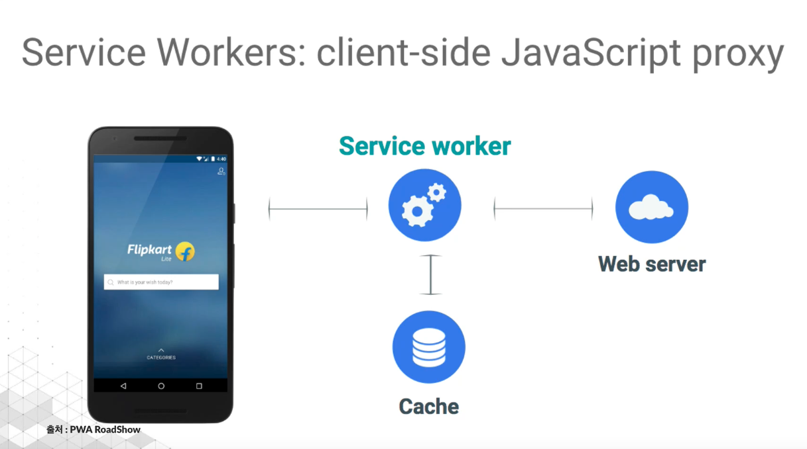
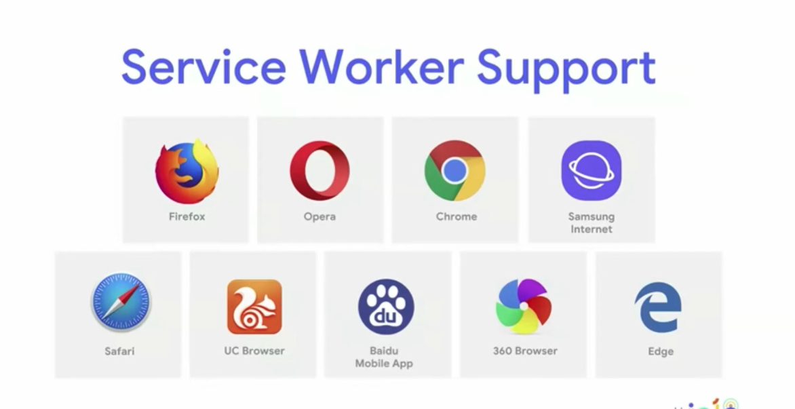
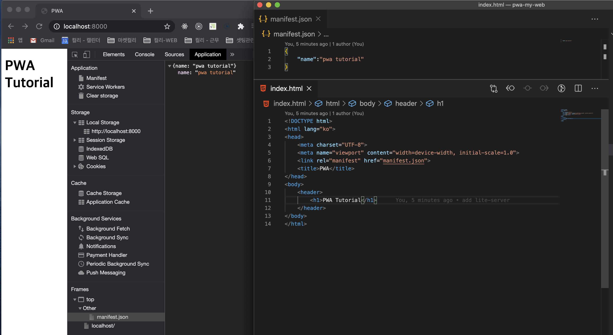

# pwa-my-web

PWA 같이 공부해요~

## 1) PWA소개

- 모바일 앱과 같은 경험을 주는 최신 웹 앱
- 앱 아이콘, 앱 아이콘 설치배너, 모바일 푸시, 오프라인 경험을 제공
- HTML, CSS, JS로 구현하는 웹 애플리케이션

> "높은 사용자 경험을 제공하기 위한 웹 앱의 진화"

### 등장배경

- 모바일 시장의 폭잘적인 성장
- 모바일 웹 보다는 모바일 애플리케이션을 많이 사용한다. ex) 아이콘
- 모바일 앱 영역을 커버하기 위한 시도들 - Hybrid App, React Native
  - 안드로이, IOS에 최종적으로 종속적이다.
- 순전하게 웹 기술만으로 만들어 내고 싶다.
- Offline Web의 필요성

### 특징

- Responsive
  - 반응형 웹 디자인
- 🟣 App-like & Discoverable
  - 설치 배너가 생성된다.
  - 앱 아이콘이 생성된다.
- 🔴 Engageable
  - push 알람.
  - PC와 단말기 커버가 가능하다.
- Connectivity
  - Online = Offline 경험을 제공한다.
- Safe
  - 제약사항 기본 기술
  - https 프로토콜이 있어야 가능하다.

### 적용사례

- instagram, uber, twitter...

### 제작기술

- manifest.json
- Service Workers: client-side Javascript Proxy
  

### 지원 브라우저



## 2) 웹 앱 매니페스트 구성하기.

- Web App Manifest - install Banner & App Icon

### 2-1) Web App Manifest 란?

- Progressive Web App의 설치와 앱 구성정보를 담고 있는 Json형식의 설정파일
  - 앱 아이콘, 화면 런쳐방식 및 배경색, 시작페이지 등을 설정할 수 있는 JSON파일
- 앱 관련 구성정보에는 아래와 같은 항목들이 설정 됩니다.
  - Start URL: 웹 앱이 시작되는 시점
  - Launch Image: 웹 앱 시작 화면
  - Display Type: 웹 앱의 화면 형태
  - Display Orientation: 웹 앱 화면 방향
  - App Icon: 앱 아이콘 이미지와 크기
  ```json
  {
    "short_name": "앱 아이콘 이름",
    "name": "하단 설치 배너에 표기될 이름 & 앱에서 검색시 키워드",
    "icons": [
      {
        "src": "dist/images/icons.icon-32x32.png",
        "type": "images/png",
        "size": "32x32"
      },
      {}
    ],
    "background_color": "#1E88E5",
    "display": "standalone",
    "start_url": "./"
  }
  ```

### 2-2) Web App Manifest 파일 등록

- 메인 HTML 파일의 head에 meta 태그 추가

```html
<link rel="manifest" href="/mainfest.json" />
```



> Chrome > 검색(개발자도구) > Application 에서 Manifest내용을 확인 할 수 있습니다.

### 2-3) Web App Manifest 주요 구성 정보

#### 1. App Icon

- 해당 웹 사이트가 모바일 화면에서 표시될 아이콘 이미지 지정

  - src: 로딩할 이미지 파일경로
  - type: 로딩할 이미지 타입
  - size: 로딩할 이미지 크기

```json
{
  "icons": [
    {
      "src": "images/touch/icon-128x128.png",
      "type": "image/png",
      "size": "128x128"
    },
    {
      "src": "images/touch/icon-152x152.png",
      "type": "image/png",
      "size": "152x152"
    },
    {
      "src": "images/touch/icon-192x192.png",
      "type": "image/png",
      "size": "192x192"
    }
  ]
}
```

#### ❗️❗️❗️ 주의 사항 ❗️❗️❗️

- app icon 미지정시 html파일의 link rel="icon"> 태그를 검색한다.
- Safari의 경우 아래의 meta 태그를 head에 별로돌 추가해 주어야 한다.

```html
<link rel="apple-touch-icon" href="touch-icon-iphone.png" />
<link rel="apple-touch-icon" sizes="152x152" href="touch-icon-ipad.png" />
<link
  rel="apple-touch-icon"
  sizes="180x180"
  href="touch-icon-iphone-retina.png"
/>
<link
  rel="apple-touch-icon"
  sizes="167x167"
  href="touch-icon-ipad-retina.png"
/>
```

#### 2. Launch Image - Splash Screen

- 웹앱이 시작될 때 거치는 시작 화면을 설정 가능
- 모바일 앱의 시작과 동일한 느낌을 가져감
- 화면의 조합: 아이콘 + 배경색 + 아이콘 이름
  - 배경색 설정의 <b>background_color</b>속성 이용
  ```json
  { "background_color": "#FFF" }
  ```
  - 아이콘은 icon에 지정한 이미지 중 128dp = 192px에 가장 가까운 크기로 지정
  - 따라서, 192px 크기의 이미지는 꼭 지정
    > dp: 다양한 모바일 화면 크기에 동일한 비율로 출력되게 하는 픽셀단위
